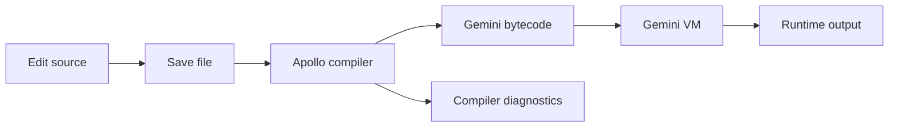

# Apollo IDE overview

## Purpose

Apollo IDE is a **cross-platform Qt-based IDE** for building software that targets the
**Gemini Virtual Machine**. It is a sister project to **apollo-compiler** and
**gemini-system**: Apollo provides language front-ends and bytecode emission; Gemini
provides the portable VM; this IDE provides the editing and build experience that ties
those tools together as external processes.

**Initial focus:** Apollo Pascal  
**Long-term:** additional Apollo language front-ends as they are developed

## High-level goals

- Deliver a clean, simple, cross-platform IDE for Apollo compilers.
- Provide a unified workflow: edit → compile → run.
- Remain architecturally independent of the Gemini System (no in-process Pick/OS coupling).
- Support multiple Apollo language compilers as they mature.
- Integrate with the Gemini VM through a stable external process interface.
- Grow organically through iterative milestone development.

## Core architectural principles

- **Standalone Qt application:** the IDE owns UI and workflow, not the compiler or VM.
- **External toolchain:** invoke `apolloc` (and later other drivers) as command-line processes.
- **External runtime:** execute Gemini bytecode via the standalone Gemini VM process.
- **Language-agnostic shell:** adapters isolate language-specific compile/run details so
  new Apollo front-ends can plug in without rewriting the IDE core.
- **Incremental evolution:** ship a thin end-to-end path first; thicken features (projects,
  highlighting, debugging) in later milestones.

## Target workflow (MVP)

## Toolchain relationships

| Concern | Primary home |
|---------|----------------|
| Pascal (and later) front-ends, `.tbc` emission | **apollo-compiler** |
| Portable Gemini VM runner | **gemini-system** |
| Edit / compile / run UX | **apollo-ide** (this project) |

Early milestones prefer **process boundaries** over shared libraries. In-process compiler
services may come later once CLI integration is proven.

## See also

- [Milestones](milestones.md) — roadmap index
- [Milestone 0 — Project skeleton](milestones/00-project-skeleton.md)
- [Milestone 1 — End-to-end edit → compile → run](milestones/01-end-to-end-mvp.md)
- [Milestone 2 — Editor polish](milestones/02-editor-polish.md)
- [Milestone 3 — Editor tabs](milestones/03-editor-tabs.md)
- Sister projects: `apollo-compiler`, `gemini-system` (sibling repositories)
